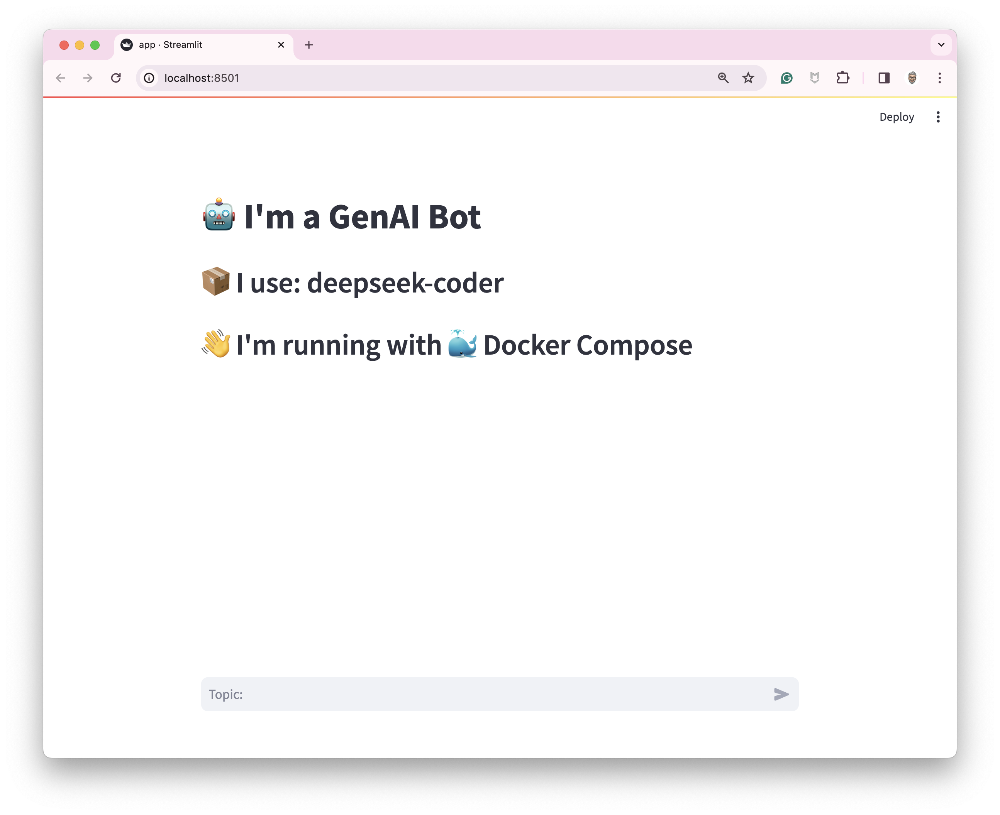
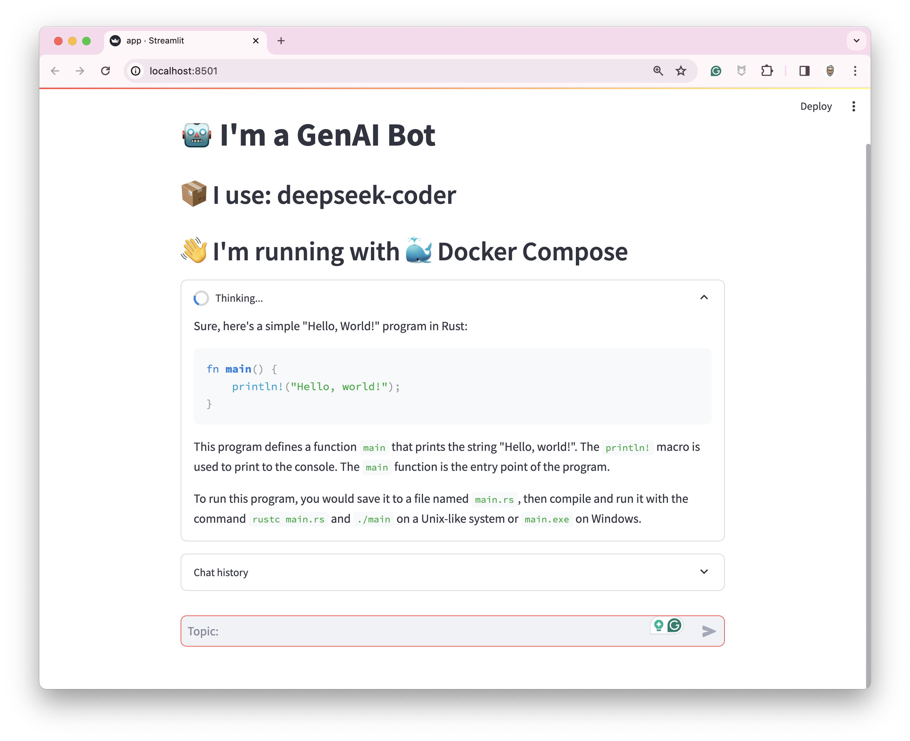
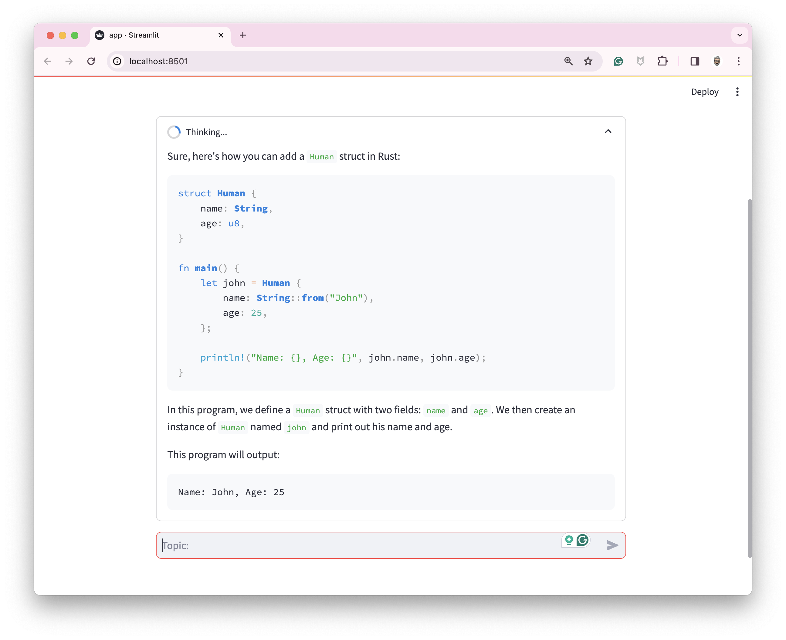
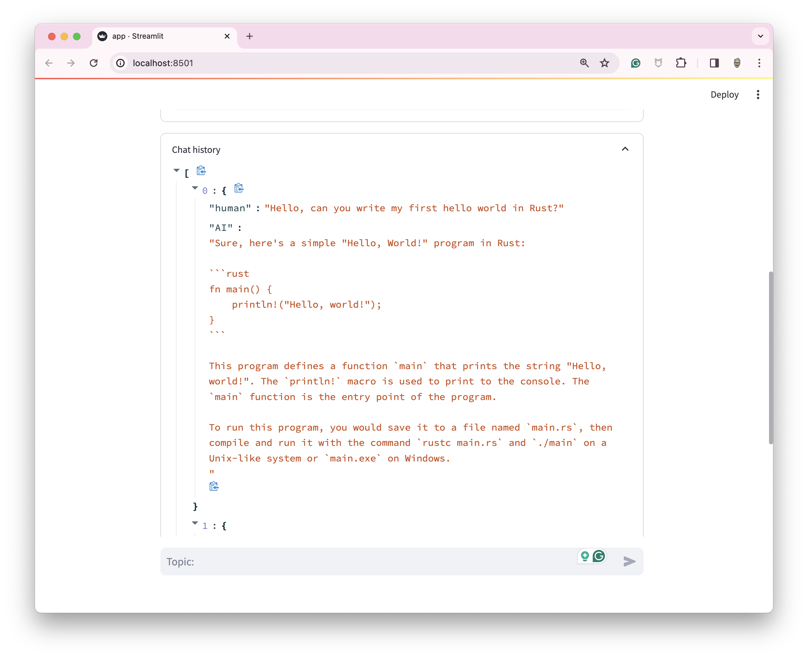

# my-little-teacher

## How to use this demo

First, start the Docker Compose stack with the following command

> If you run Ollama on MacOS (with GPU):
```bash
docker compose --env-file .mac.env --file compose.mac.yaml up
# or:
docker compose --env-file .mac.env --file compose.mac.yaml watch
```

> If you run Ollama into a container (without GPU):
```bash
docker compose up
docker compose watch
```

> The first launch could take a moment (because of the first download of the LLM)

Once the project started, open [http://localhost:8501/](http://localhost:8501/)



Try this prompt: `Hello, can you write my first hello world in Rust?`



Try this prompt: `Can you add a Human struct (with name and age)`



Show the history of the chat:


